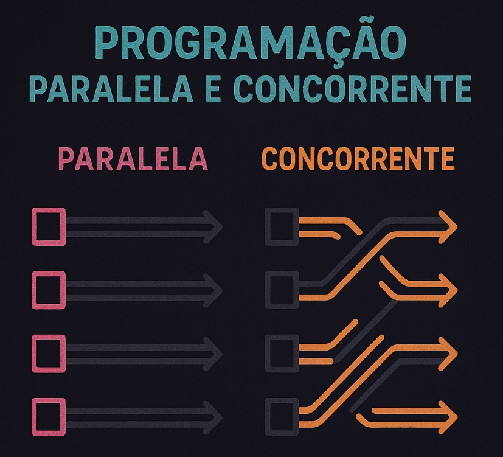

# Sobre
Esse é um repositório dedicado ao componente Programação Paralela e Concorrente, do curso de Bacharel em Ciência da Computação na Universidade Católica de Santos - UNISANTOS. Professor responsável pelo componente: Mestre Márcio Luiz Piva.

## Um pouco sobre os códigos
Os códigos presentes nesse repositório estão todos em C++, linguagem essa que permite o uso de threads, ferramenta importantíssima para o estudo desse componente.

# Como rodar?
Os programas foram "rodados/executados" por um computador com o Sistema Operacional Windows. Mas para rodar na sua máquina você vai precisar:

- Compilador GCC 11 ou superior para C++

## Como compilar e executar:
Compilar:
```bash
g++ exemplo.cpp -o exemplo
```
Executar:
```bash
.\exemplo.exe 
```


